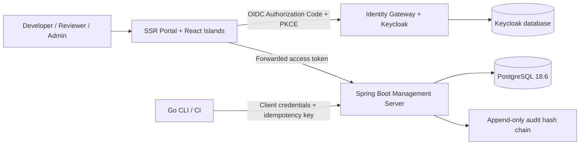

## Cover

# AI-SDLC

### Governance architecture for AI delivery and quality evidence

**Build 1 · xDev AI · 2026**

## Slide 1

# AI accelerates delivery — governance retains accountability

- AI-SDLC turns specifications, validation, and approval into a verifiable control plane.
- The validator runs locally, deterministically, and never calls AI; every execution requires a pinned model.
- Human approval retains decision authority at merge requests, phase gates, and exceptions.

> The design targets delivery speed without sacrificing auditability or ownership.

## Slide 2

# Four planes, one operating standard

| Plane | Responsibility | Primary components |
|---|---|---|
| **Execution** | Validate specifications on developer machines and in CI | Go CLI, Spec Kit |
| **Control** | Apply policy and authorized decisions | Spring Boot Management API |
| **Evidence** | Preserve traceability, findings, and immutable history | PostgreSQL, audit hash chain |
| **Experience** | Provide a clear, contextual management experience | SSR Portal, React Islands |

## Slide 3

# A continuous path from requirement to evidence

1. **Author** creates Requirement → Spec → Task → Test under the pinned Constitution and Spec Kit.
2. **Validate** runs through the Go CLI with a mandatory model revision; `--bare` is prohibited.
3. **Sync** sends findings and evidence digests to the Management API with an idempotency key.
4. **Review** requires a human decision; the audit ledger preserves the full chronology.

## Slide 4

# System architecture: local speed, centralized governance

## Slide 5

# Authorization is enforced in multiple layers

- **Keycloak** is the sole identity authority; realm roles include `admin`, `developer`, and `reviewer`.
- **Spring Security** maps roles to authorities and checks them at both endpoint and service boundaries.
- **Project membership** is a second guard: an organization role does not grant access to every project.
- **Portal** is a confidential OIDC client; the browser never holds an access token for the React application.

## Slide 6

# The Management Server is the unified control plane

| Capability | Managed decisions and data |
|---|---|
| Project & Kit Registry | Project settings, core, extension, preset, override, and kit pins |
| Governance | Constitution, policy, capability grant, exception request |
| Validation | Validation run, finding severity, evidence, and trace links |
| Review | Merge request, phase gate, APPROVED/REJECTED decision |
| Quality | DORA counter-metrics, review health, rework, and specification alignment |

## Slide 7

# The audit ledger turns events into evidence

- Every validation, policy change, exception, agent launch, and review decision creates a sequenced event.
- `previous_hash` and `event_hash` form a chain whose continuity can be verified.
- A PostgreSQL trigger prohibits `UPDATE` and `DELETE` on `audit_events`.
- Idempotent evidence synchronization lets CI retry without duplicating evidence or audit events.

## Slide 8

# Portal: SSR for trust, React for exploration

| Experience layer | Technology | Value |
|---|---|---|
| Shell and security | Spring MVC + Thymeleaf + Keycloak OAuth2 | SSR, CSRF, secure session, HTML fallback |
| Interactive islands | React 19.2 + Vite 8.2 | Selective hydration without turning the portal into an SPA |
| Data visualization | ECharts + Cytoscape.js | DORA quality analytics and traceability explorer |
| Progressive enhancement | HTMX + Alpine.js + Tabulator + Lucide | Tables and filters, focused interactions, icon system, keyboard fallback |

## Slide 9

# A pinned stack for reproducibility and consistent operations

| Layer | Build 1 technology |
|---|---|
| Runtime | Java 25.0.3 LTS, Spring Boot 4.1.0 |
| Identity | Keycloak 26.7.1 behind an identity gateway |
| Data | PostgreSQL 18.6, Flyway migrations |
| Client | Thymeleaf SSR, React 19.2, Vite 8.2 |
| Validator | Deterministic Go CLI |
| Local topology | Docker Compose: portal, API, Keycloak, PostgreSQL, gateway |

## Slide 10

# Deployment topology protects the public surface area

- **Portal** is the user entry point; the API and databases do not require direct public exposure.
- **Identity gateway** is the public edge for Keycloak; Keycloak is not directly public.
- **Management API** accepts only valid tokens from the portal or service tokens from CLI and CI.
- Secrets are never committed; Compose pins image versions and separates the Keycloak database from control-plane data.

## Slide 11

# Build 1: a foundation ready to extend

| Completed | Next expansion |
|---|---|
| Control plane, RBAC, REST API, audit trigger, Go CLI | Docker integration regression with PostgreSQL and Keycloak |
| Responsive SSR portal, React Islands, DORA/trace/evidence/review workspaces | Administrative forms for projects, policies, and exception requests |
| Local frontend assets, SRI manifest, SSR fallback | Desktop context adapter, Git-provider workflow, multi-agent campaigns |

## Slide 12

# Faster delivery. Stronger evidence. Clearer decisions.

### AI-SDLC creates a delivery system that can accelerate with AI while remaining accountable to people.

**xDev AI · Build 1 architecture**
