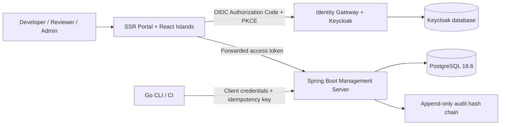

## Cover

# AI-SDLC

### Kiến trúc quản trị delivery AI và bằng chứng chất lượng

**Build 1 · xDev AI · 2026**

## Slide 1

# AI tăng tốc delivery — governance giữ trách nhiệm

- AI-SDLC biến specification, validation và phê duyệt thành một control plane có thể kiểm chứng.
- Validator chạy local, tất định và không gọi AI; mọi execution đều phải có model pin.
- Human approval giữ quyền quyết định tại merge request, phase gate và exception.

> Thiết kế hướng đến tốc độ phát triển mà không đánh đổi auditability hoặc ownership.

## Slide 2

# Bốn plane, một chuẩn vận hành

| Plane | Vai trò | Thành phần chính |
|---|---|---|
| **Execution** | Validate specification tại máy developer/CI | Go CLI, Spec Kit |
| **Control** | Áp policy và quyết định có phân quyền | Spring Boot Management API |
| **Evidence** | Lưu traceability, findings và lịch sử bất biến | PostgreSQL, audit hash chain |
| **Experience** | Cung cấp trải nghiệm quản trị, rõ ràng và có ngữ cảnh | SSR Portal, React Islands |

## Slide 3

# Từ requirement đến evidence liên tục

1. **Author** tạo Requirement → Spec → Task → Test theo Constitution và Spec Kit đã pin.
2. **Validate** chạy bằng Go CLI với model revision bắt buộc; `--bare` bị cấm.
3. **Sync** đẩy findings và evidence digest lên Management API với idempotency key.
4. **Review** yêu cầu quyết định con người; audit ledger bảo toàn toàn bộ chronology.

## Slide 4

# Kiến trúc hệ thống: local speed, centralized governance

## Slide 5

# Quyền được áp dụng ở nhiều lớp

- **Keycloak** là identity authority duy nhất; realm role gồm `admin`, `developer`, `reviewer`.
- **Spring Security** map role thành authority và kiểm tra ở endpoint lẫn service boundary.
- **Project membership** là guard thứ hai: có role tổ chức không đồng nghĩa được truy cập mọi project.
- **Portal** là confidential OIDC client; browser không nắm access token của React application.

## Slide 6

# Management Server là control plane thống nhất

| Năng lực | Quyết định và dữ liệu quản lý |
|---|---|
| Project & Kit Registry | Project settings, core, extension, preset, override và kit pin |
| Governance | Constitution, policy, capability grant, exception request |
| Validation | Validation run, finding severity, evidence và trace links |
| Review | Merge request, phase gate, APPROVED/REJECTED decision |
| Quality | DORA counter-metrics, review health, rework, spec alignment |

## Slide 7

# Audit ledger biến sự kiện thành bằng chứng

- Mỗi validation, policy change, exception, agent launch và review decision tạo event theo sequence.
- `previous_hash` và `event_hash` tạo hash chain có thể kiểm tra tính liên tục.
- PostgreSQL trigger cấm `UPDATE` và `DELETE` trên `audit_events`.
- Evidence synchronization idempotent giúp CI retry mà không nhân đôi evidence hoặc audit event.

## Slide 8

# Portal: SSR cho tin cậy, React cho khám phá

| Lớp trải nghiệm | Công nghệ | Giá trị |
|---|---|---|
| Khung và bảo mật | Spring MVC + Thymeleaf + Keycloak OAuth2 | SSR, CSRF, session an toàn, fallback HTML |
| Islands tương tác | React 19.2 + Vite 8.2 | Hydrate có chọn lọc, không biến portal thành SPA |
| Data visualization | ECharts + Cytoscape.js | DORA quality analytics và traceability explorer |
| Progressive enhancement | HTMX + Alpine.js + Tabulator + Lucide | Table/filter, interaction nhỏ, icon system, keyboard fallback |

## Slide 9

# Stack được pin để tái lập và vận hành nhất quán

| Layer | Công nghệ Build 1 |
|---|---|
| Runtime | Java 25.0.3 LTS, Spring Boot 4.1.0 |
| Identity | Keycloak 26.7.1 sau identity gateway |
| Data | PostgreSQL 18.6, Flyway migrations |
| Client | Thymeleaf SSR, React 19.2, Vite 8.2 |
| Validator | Go CLI deterministic |
| Local topology | Docker Compose: portal, API, Keycloak, PostgreSQL, gateway |

## Slide 10

# Deployment topology bảo vệ surface area

- **Portal** là entry point của người dùng; API và database không cần public trực tiếp.
- **Identity gateway** là public edge cho Keycloak; Keycloak không public trực tiếp.
- **Management API** chỉ nhận token hợp lệ từ portal hoặc service token từ CLI/CI.
- Secrets không commit; Compose pin image versions và tách database Keycloak khỏi control-plane data.

## Slide 11

# Build 1: nền tảng đã sẵn sàng mở rộng

| Đã hoàn thành | Mở rộng kế tiếp |
|---|---|
| Control plane, RBAC, REST API, audit trigger, Go CLI | Docker integration regression với PostgreSQL + Keycloak |
| SSR portal responsive, React Islands, DORA/trace/evidence/review workspaces | Form quản trị cho project, policy và exception request |
| Local frontend assets, SRI manifest, SSR fallback | Desktop context adapter, Git provider workflow, multi-agent campaigns |

## Slide 12

# Faster delivery. Stronger evidence. Clearer decisions.

### AI-SDLC tạo một delivery system có thể tăng tốc cùng AI — và vẫn chịu trách nhiệm trước con người.

**xDev AI · Build 1 architecture**
