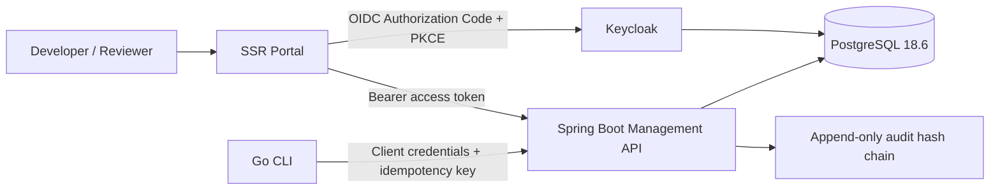

# Architecture

How the platform is put together: the four planes, the control-plane API, and the portal that fronts it. A presentation-format walkthrough of the same material is in [`ai-sdlc-architecture-slides.md`](ai-sdlc-architecture-slides.md).

- [Build 1 Architecture](#build-1-architecture)
- [Control Plane API](#control-plane-api)
- [Portal Workflows](#portal-workflows)
- [SSR Portal Authentication Experience](#ssr-portal-authentication-experience)
- [Frontend library strategy](#frontend-library-strategy)
- [Portal localization policy](#portal-localization-policy)

## Build 1 Architecture

The platform separates **execution**, **control**, **evidence**, and **experience**. The Go CLI owns deterministic local validation. The Spring Boot management server owns all shared state and authorization-protected decisions. PostgreSQL provides transactional integrity; a database trigger prevents `UPDATE` or `DELETE` against recorded audit events. Keycloak is the sole identity authority, while the portal is a server-rendered browser application that acts as a confidential OIDC client. In the local topology, an identity gateway exposes Keycloak through `auth.localhost`; Keycloak itself is not directly published.



The caller’s Keycloak realm roles are translated into `ROLE_admin`, `ROLE_developer`, and `ROLE_reviewer` authorities. API authorization is then enforced at both endpoint and service boundaries. A project membership is an additional guard; a realm-level role alone does not grant access to every project.

| Boundary | Security control |
|---|---|
| Browser → Portal | OIDC authorization-code flow, secure server session and CSRF protection |
| Portal → API | Forwarded, short-lived access token; API validates issuer, signature and role claims |
| CLI → API | OAuth2 client-credentials token plus idempotency key for evidence ingestion |
| API → PostgreSQL | Least-privileged app schema user, Flyway migrations and append-only audit trigger |
| Keycloak | Separate database, realm roles, confidential clients and non-committed secrets |

---

## Control Plane API

The management server exposes a versioned REST control plane at `/api/v1`. All non-health endpoints require a Keycloak-issued JWT. The API never decides a review on behalf of an AI model: review and exception decisions are accepted only when a human principal holding the appropriate role sends the mutation.

Interactive OpenAPI documentation is available at `/swagger-ui.html` to the `admin` role. The raw specification is at `/v3/api-docs` and is also protected by that role.

### Authorization Model

| Role | Primary responsibilities |
|---|---|
| `admin` | Creates organizations and projects; administers membership, registry lifecycle, policies, constitutions, capabilities, metrics, API documentation and audit verification. |
| `developer` | Creates validation evidence, trace nodes/edges, exception requests and review requests within projects where they have membership. |
| `reviewer` | Views project governance/evidence and makes final human review or exception decisions. |
| `viewer` | Reads project-scoped governance, quality, traceability and evidence data only. |

Project-scoped reads also require a `project_memberships` record. Membership checks are enforced inside the service boundary; controller role checks do not replace project scope validation.

### Pagination and Errors

Collection endpoints use `page` (zero-based) and `size` (1–100). Supported endpoint-specific sort fields are allow-listed by the server. Paged responses follow this envelope:

```json
{
  "items": [],
  "page": 0,
  "size": 25,
  "totalItems": 0,
  "totalPages": 0
}
```

Invalid input produces an RFC 9457 `application/problem+json` response. Conditional governance updates return `409 Conflict` when a decision was already taken, a record was unpinned, or a lifecycle precondition is no longer true.

### High-Value Workflow Endpoints

| Workflow | Resource path | Notes |
|---|---|---|
| Organization/project/membership administration | `/organizations`, `/organizations/{id}/projects`, `/projects/{id}/memberships` | The final project owner cannot be demoted or deleted. |
| Spec Kit registry | `/organizations/{id}/spec-kits`, `/projects/{id}/spec-kits` | Only an active kit in the same organization can be pinned; duplicate assignments are rejected at database level. |
| Policy and constitution lifecycle | `/organizations/{id}/policies`, `/organizations/{id}/constitutions` | Activation/deactivation transitions include audit entries and lifecycle attribution. |
| Exceptions and reviews | `/projects/{id}/exception-requests`, `/projects/{id}/review-items` | Decisions are final and require an expected `PENDING` state. Approved exceptions must include a future expiry. |
| Validation evidence | `/cli/projects/{id}/validation-runs`, `/projects/{id}/validation-runs` | CLI ingest requires `Idempotency-Key`, a non-empty model pin and `bare=false`. |
| Evidence Repository | `/projects/{id}/evidence-assets` | Multipart upload verifies SHA-256 and stores bytes privately through an S3-compatible adapter. `GET /{assetId}` authorizes a short-lived presigned download URL; `PUT /{assetId}/retention` only extends a human-authorized retention lock; `DELETE /{assetId}` soft-deletes metadata. |
| Audit verification | `/organizations/{id}/audit-events/verify` | Recomputes the append-only ledger hash chain without modifying historical events. |

### Runtime Protection and Observability

The API emits a correlation ID on requests and structured logs. A token-bucket limiter protects `/api/**`; its default capacity is 120 requests per minute per source address. Before horizontal scaling, configure a distributed Bucket4j backend so limits remain cluster-wide.

Health endpoints expose liveness and readiness groups under `/actuator/health`. Readiness includes the database and the custom audit-ledger indicator.

Optional capabilities report `DEGRADED`, never `DOWN`. Spring Boot's mail indicator is binary, so an unreachable SMTP relay used to make the aggregate `DOWN` with HTTP 503 — a false statement about a service whose governed API, audit ledger and evidence storage are unaffected, and a hazard if any probe were ever pointed at the aggregate, since an optional dependency could then take the control plane out of service. `MailDeliveryHealthIndicator` replaces it: `DEGRADED` is ordered below `UP`, so the aggregate stays `UP` while the component states that email delivery is unavailable and which setting to change. Mail is deliberately absent from readiness, because a pod that cannot send email still serves every governed request. Component details are shown only to an authenticated caller — the endpoint is public so probes can read the status, and a public body would hand an unauthenticated reader the names and failure messages of internal dependencies. Set `AISDLC_ALLOWED_ORIGINS` to explicit production portal origins; wildcard origins are deliberately unsupported.

---

## Portal Workflows

The AI-SDLC portal is a Spring MVC and Thymeleaf application. It is deliberately **server-rendered first**: JavaScript enhances charts, graph exploration and dense evidence views, but governance writes, pagination, read views and human decisions work as ordinary CSRF-protected HTML forms.

### Context and Authorization

Select an organization and, optionally, a project from the persistent context bar. The portal forwards the authenticated Keycloak access token only from the server to the management API. Access tokens are never included in HTML, browser storage or JavaScript props.

Every form result redirects to the relevant scoped page and uses a flash notification. API validation, authorization and conflict errors are rendered as actionable messages rather than being silently discarded.

| Portal workspace | Supported workflow |
|---|---|
| Projects | Create an organization, create a project, invite members, change project role and remove a membership. The server prevents removal or demotion of the final owner. |
| Spec Kits | Register immutable versions, inspect lifecycle, pin by precedence, unpin a resolved assignment and deprecate an active kit with a reason. |
| Governance | Record versioned policies and constitutions, activate/deactivate lifecycle versions, submit exception requests, and create expiring scoped capability grants. |
| Validations | Filter and page validation runs; select a run to inspect deterministic findings and evidence digests/verified URIs. |
| Evidence Repository | Upload a bounded project-scoped artefact with type/access classification, list its SHA-256 provenance, open an authorized short-lived download, extend a retention lock, or soft-delete metadata when holding owner/reviewer authority. The portal sends multipart through its server-side API client; object-store credentials and bearer tokens never reach the browser. |
| Traceability | Inspect the requirement-to-evidence graph in both a no-JavaScript summary and enhanced interactive explorer. |
| Reviews | Submit merge-request, phase-gate or exception review requests; reviewers provide a human final approve/reject decision and rationale. |
| Quality | Record a real metric period in UTC and inspect DORA counter-metrics in tables or an enhanced analytics island. |
| Audit | Filter and page immutable events, then read the hash-chain verification state for the organization. |

### Human Decision Guardrails

Review and exception records are only opened from explicit server-side forms. A pending item can be decided once by an authorized human; the management API rejects stale or duplicate finalizations. Exception approval requires a dated expiry, and each successful mutation writes an immutable audit event.

### Progressive Enhancement and Accessibility

The portal uses semantic tables, labels, visible keyboard focus, `aria-live` for timely page updates and server-side empty/error states. The React Islands are loaded from a locally built Vite asset manifest and consume serialized read models only. The SSR tables remain available for assistive technology, CSP-restricted deployments and JavaScript-disabled browsers.

### Metric Data Contract

The quality workspace stores immutable period snapshots rather than browser-calculated scores. All timestamps must be ISO-8601 UTC instants. The following optional numeric fields form the snapshot: deployment frequency, lead time in hours, change failure rate, PR review-time delta in hours, rework rate, review queue health and specification alignment score. Metric producers should supply the calculation provenance in the API-side ingestion integration before promoting data to organizational reporting.

---

## SSR Portal Authentication Experience

### Purpose

The SSR portal keeps its Keycloak integration explicit without revealing identity-provider internals. The authenticated workspace exposes a compact **Keycloak session connected** status indicator. This indicator means that the current server-rendered request has an OAuth2 access token available for the portal's server-side management API client. It does not report token lifetime, realm topology, client configuration, claims, or any credential material.

> The browser never receives a management API access token. The portal forwards the access token only in server-to-server requests to the management control plane.

### Session-expiry and identity-provider failure flow

| Trigger | Portal behavior | User-facing result |
| --- | --- | --- |
| An unauthenticated request targets `/app/**` | Spring Security saves the eligible request and sends the browser to `/session-expired`. | A neutral recovery screen offers **Sign in again** and **Return to home**. |
| Keycloak authorization-code login fails | OAuth2 login sends the browser to `/session-expired`. | The recovery screen does not expose the provider error, authorization code, state parameter, or client information. |
| Management control plane returns HTTP `401` during an SSR read | `ManagementApiClient` classifies the response as `AUTHENTICATION_REQUIRED`; the controller redirects centrally to `/session-expired`. | The user sees one consistent recovery action rather than a raw API status message. |
| Management control plane returns HTTP `401` during a SSR mutation or evidence download | The common mutation/download helper redirects centrally to `/session-expired`. | No success flash message is shown for an operation whose authorization could not be confirmed. |
| Management control plane returns HTTP `403` | The portal returns a generic project-access message. | The user is not signed out, because an access denial is distinct from an expired session. |
| Network or non-authentication upstream fault | The portal reports a generic temporary control-plane error. | Provider and transport diagnostics remain server-side. |

After a successful reauthentication, Spring Security uses a safe saved request when one exists; otherwise it sends the user to `/app`. The portal does not accept a caller-provided arbitrary redirect target, preventing an open-redirect recovery path.

### Security and privacy controls

The recovery page is intentionally public so that an expired or absent browser session can reach it. It contains only static instructional content and links to the registered OAuth2 authorization endpoint. It does not contain a user name, prior workspace data, saved form content, access token, refresh token, Keycloak realm URL, client identifier, authorization-state value, or server error trace.

Sign-out is now submitted as a CSRF-protected `POST /logout` form rather than a state-changing link. The portal retains its existing browser security headers and keeps `/app/**` authenticated. Localized English and Vietnamese copy is supplied through the existing cookie-backed locale mechanism.

### Operations and verification

An operator should first verify that the portal can reach Keycloak and the management server using the deployment's normal readiness checks. The UI's connection indicator is not a health probe and must not be used as one. For an incident that affects Keycloak availability, users should be directed to the neutral recovery page; detailed diagnostics belong in protected server logs and observability systems.

The regression suite covers the session-recovery entry point, OAuth2 failure route, secure logout form, classification of HTTP `401` versus `403`, and SSR rendering of the connection indicator. A real runtime capture of the public recovery page is stored as [`docs/screenshots/portal-session-expired-en.png`](screenshots/portal-session-expired-en.png).

---

## Frontend library strategy

### Decision

The portal remains **Spring MVC + Thymeleaf SSR-first**. JavaScript enhances only the areas that need rich interaction; all essential content, navigation, tables, and forms must have a server-rendered HTML version that remains usable when JavaScript is disabled.

| Library | Single responsibility | Portal usage |
|---|---|---|
| HTMX 2.0.10 | Partial HTML request/response | Refresh dashboard widgets, submit administrative forms, review decisions, progressive pagination and filtering |
| Alpine.js 3.15.0 | Small local UI state | Menus, modals, disclosures, optimistic visual state; never an independent business-state store |
| Apache ECharts 6.0.0 | Quality/DORA charts | Deployment, lead-time, change-failure, review-latency, rework, and alignment-score trends |
| Cytoscape.js 3.33.1 | Interactive traceability graph | Pan, zoom, filter, and focus nodes in the requirement → specification → task → test → evidence chain |
| Tabulator 6.3.1 | Enhance large data tables | Sorting, filtering, and exporting for validation, review queue, and audit ledger; SSR tables remain the fallback |
| Lucide 0.468.0 | Icon system | Semantic icons through a local SVG sprite or asset; no icon font |

Versions are pinned in `portal/src/main/resources/static/vendor/` and are not loaded from a CDN at runtime. This avoids third-party runtime dependencies in the administrative interface and supports a strict Content Security Policy. Each version must be revalidated when dependencies are upgraded.

### Guardrails

HTMX calls only SSR controllers that return HTML fragments and always passes through Spring Security CSRF and server-side authorization. Alpine does not call the REST control plane directly. ECharts and Cytoscape render only JSON supplied by server-side controllers within an authorized project scope. Tabulator is progressive enhancement: if a script fails or JavaScript is disabled, the HTML `<table>` remains visible.

Charts and graphs are not independently sufficient for accessibility. The portal retains a numerical table or textual summary alongside each chart, an `aria-label` for every canvas container, keyboard focus for graph nodes, and an SSR traceability list alongside Cytoscape.

### React Islands architecture

React is used **only as bounded islands**; it does not replace Spring MVC/Thymeleaf with an SPA. Spring Boot continues to produce the initial HTML and controls OAuth2/Keycloak sessions, CSRF, authorization, and server-side fallback. React mounts only into explicitly marked containers after the HTML document has loaded.

| Island | SSR fallback | React responsibility | Security boundary |
|---|---|---|---|
| Quality Analytics | Summary cards and metrics table | Cross-filtering, brushing, period comparison, ECharts lifecycle | Receives only controller-provided data from a project-membership-checked scope |
| Traceability Explorer | Requirement → evidence trace table/list | Cytoscape view, search, focus, graph navigation | Does not acquire tokens or call APIs; data is released through the portal BFF |
| Evidence Workspace | Validation/findings table | Local filters, detail drawer, saved client view | Evidence mutation remains an HTML form or HTMX action protected by CSRF |
| Review Decision | Fallback SSR POST form | Rationale disclosure, validation, confirmation state | POSTs to the Spring MVC BFF, which then forwards the token to the Management API |

The build uses **React 19.2.8**, **React DOM 19.2.8**, **Vite 8.2.1**, and **@vitejs/plugin-react 6.0.5**. Vite emits a hashed bundle and manifest; Maven runs the Node build before the resource phase and then copies the manifest and bundles into `classpath:/static/react/`. Thymeleaf resolves the manifest through a server-side helper and never hard-codes a build filename.

React islands start with `createRoot`, not `hydrateRoot`, because the Thymeleaf fallback and the interactive React section own separate DOM regions. This removes hydration mismatches caused by React requiring exactly identical initial markup. If an island requires true SSR hydration in the future, a React server renderer must be added to the build pipeline and the same props snapshot must be used on both server and client.

> React must not store access tokens, perform OAuth redirects, or bypass CSRF forms. Spring Boot remains the only BFF and policy-enforcement point between the browser and the control plane.

### References

[1] [HTMX documentation](https://htmx.org/docs/) describes htmx as a mechanism for directly triggering HTTP/AJAX with HTML attributes and receiving HTML from the server.

[2] [Alpine.js Start Here](https://alpinejs.dev/start-here) documents the `x-data`, `x-on`, `x-show`, and `x-model` directives for lightweight local state.

[3] [Apache ECharts Get Started](https://echarts.apache.org/handbook/en/get-started/) confirms the pattern of initializing an instance on a container with explicit dimensions and rendering with `setOption`.

[4] [Cytoscape.js](https://js.cytoscape.org/) describes a graph/network library with JSON, layouts, selectors/queries, desktop and touch gestures, and an MIT license.

[5] [React `hydrateRoot`](https://react.dev/reference/react-dom/client/hydrateRoot) requires client React output to exactly match server-rendered HTML; differences must be treated as bugs.

[6] [Vite Backend Integration](https://vite.dev/guide/backend-integration) defines a build manifest that maps source entries to hashed bundles so a traditional backend can render the correct scripts, stylesheets, and preload dependencies.

---

## Portal localization policy

### Scope

The AI-SDLC repository uses **English** for GitHub-facing and developer-facing material: documentation, source-code comments, API descriptions, release notes, issue templates, and operations guidance. The portal offers end-user interface support for **English (`en`)** and **Vietnamese (`vi`)**.

The only intended Vietnamese source text in the repository is the portal's translation resource at `portal/src/main/resources/static/js/locale.js`. It is product content that must be present in source control so the browser can render Vietnamese without a runtime translation service. It is not developer-facing documentation.

### Locale resolution

`PortalLocalizationConfig` uses Spring's `CookieLocaleResolver` with the `AISDLC_LOCALE` cookie. English is the default and fallback locale. A user can choose a locale from the portal language switcher; the switcher adds `?lang=en` or `?lang=vi`, Spring persists that selection for 365 days, and the current URL retains the selected locale for shareable navigation.

The portal renders `<html lang>` from the server locale. The SSR page remains useful without JavaScript. When JavaScript is available, `locale.js` translates the static portal shell and continues translating HTMX fragments and React Island nodes added after initial render. No localization data contains access tokens, project evidence, or other tenant data.

| Concern | Contract |
|---|---|
| Default and fallback | English (`en`) |
| Supported UI locale | Vietnamese (`vi`) |
| Preference persistence | `AISDLC_LOCALE` cookie, path `/`, 365-day lifetime |
| Server-side rendering | `CookieLocaleResolver` and `LocaleChangeInterceptor` on GET `lang` parameter |
| Progressive enhancement | The SSR English page is still complete without JavaScript; Vietnamese client translation activates only after the selected locale is rendered |
| React Islands | Consume the browser-local `AISDLC_I18N` translation contract; never own locale security state |
| API and CLI | Remain language-neutral; stable codes and RFC 9457 problem types are not localized |

### Adding a new UI string

Add the English source string to the relevant SSR template or React Island, then add its Vietnamese equivalent to the `vi` dictionary in `locale.js`. Keep identifiers, API values, role names, policy state values, model pins, SHA-256 values, and audit hashes unmodified. Use UTF-8 and include the correct diacritics.

Before merging, run the portal test suite and JavaScript build, then verify that the English fallback still works without client-side translation:

```bash
mvn -B -pl portal test
(cd portal/frontend && npm run build)
node --check portal/src/main/resources/static/js/locale.js
```
