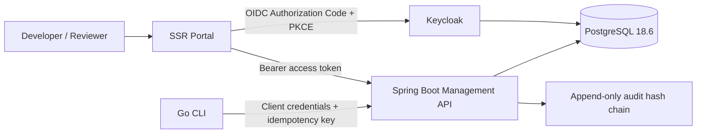

# Build 1 Architecture

The platform separates **execution**, **control**, **evidence**, and **experience**. The Go CLI owns deterministic local validation. The Spring Boot management server owns all shared state and authorization-protected decisions. PostgreSQL provides transactional integrity; a database trigger prevents `UPDATE` or `DELETE` against recorded audit events. Keycloak is the sole identity authority, while the portal is a server-rendered browser application that acts as a confidential OIDC client. In the local topology, an identity gateway exposes Keycloak through `auth.localhost`; Keycloak itself is not directly published.

The caller’s Keycloak realm roles are translated into `ROLE_admin`, `ROLE_developer`, and `ROLE_reviewer` authorities. API authorization is then enforced at both endpoint and service boundaries. A project membership is an additional guard; a realm-level role alone does not grant access to every project.

| Boundary | Security control |
|---|---|
| Browser → Portal | OIDC authorization-code flow, secure server session and CSRF protection |
| Portal → API | Forwarded, short-lived access token; API validates issuer, signature and role claims |
| CLI → API | OAuth2 client-credentials token plus idempotency key for evidence ingestion |
| API → PostgreSQL | Least-privileged app schema user, Flyway migrations and append-only audit trigger |
| Keycloak | Separate database, realm roles, confidential clients and non-committed secrets |
